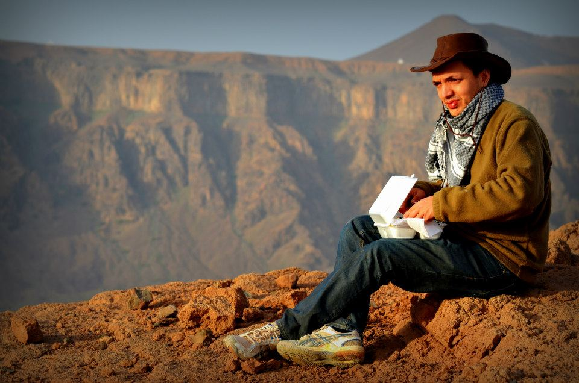

Hi, I'm Yan. I'm a Postdoctoral fellow in the [civil engineering department](https://engineering.jhu.edu/civil/) at [Johns Hopkins
University](http://jhu.edu/).

I'm interested in computational modeling in solid mechanics and have broader interest in interdisciplinary research. I am currently working on a wavelet-based adaptive hierarchical method for FEM, with specific application to crystal plasticity in mind. I also enjoy taking part in outreach, mainly through courses I give at the Baltimore Tool library.

[You can view my CV here.](pdf/resume_yan.pdf)

## Contact details:

<yazdoud1@jhu.edu>

Latrobe Hall 307
Johns Hopkins University  
3400 N. Charles Street  
Baltimore, MD
21218  
USA
